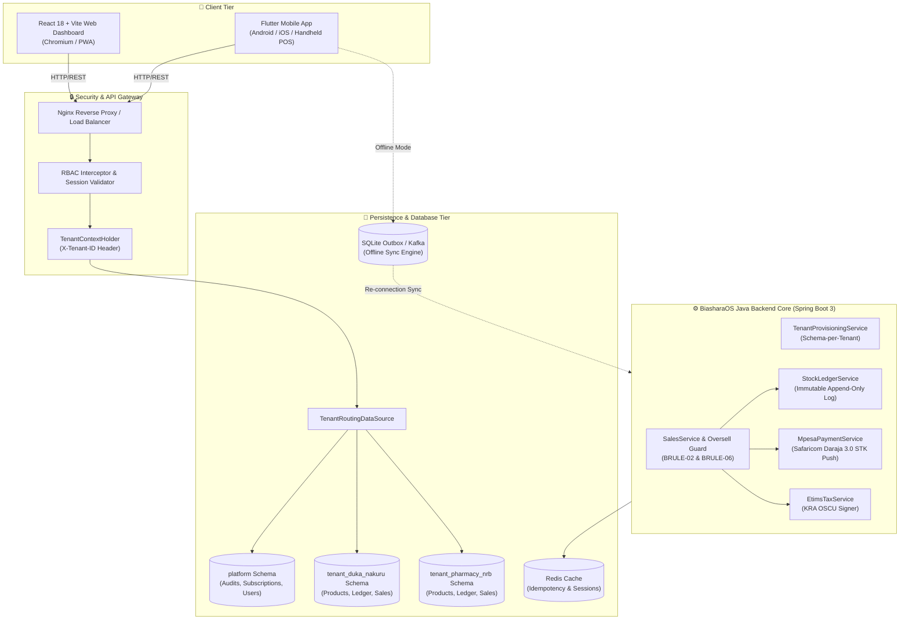
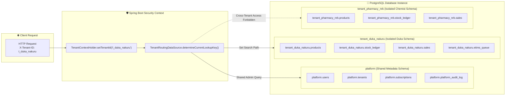
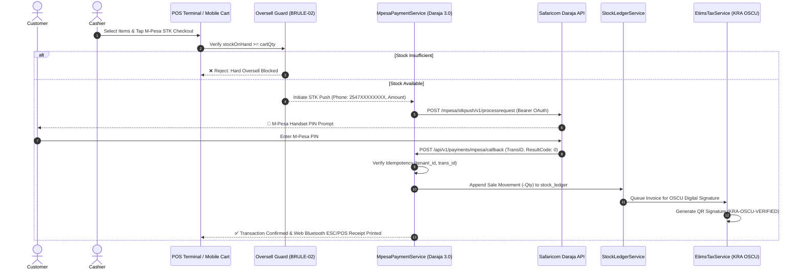
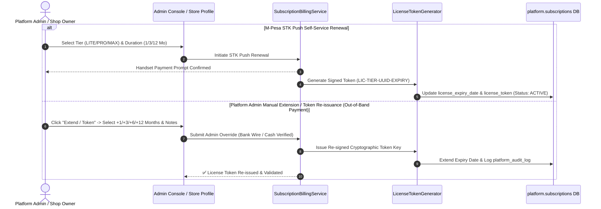

# BiasharaOS — Multi-Tenant Business & Inventory Intelligence Platform

**BiasharaOS** is an inventory-intelligence-first, cloud-native multi-tenant SaaS platform engineered specifically for Kenyan MSMEs (dukas, pharmacies, hardware stores, salons, and small distributors).

It consolidates four core operational primitives into one system of record:
1. **Inventory Intelligence**: Stock levels, append-only stock ledger, low-stock threshold alerts, slow-mover (>60 days) and dead-stock (>120 days) analytics, weighted items (Kg/Litres), and auto SKU generation.
2. **Sales & POS**: High-speed cart, hard stock oversell prevention guards, cashier discount caps (10%) with Manager PIN step-up, Web Bluetooth ESC/POS thermal printing, sequential receipt generation, offline-capable POS.
3. **M-Pesa & Payments**: Safaricom Daraja 3.0 STK Push, phone sanitization (`2547XXXXXXXX`), C2B Paybill/Till reconciliation with 1-tap target sale receipt selection, automated idempotency, live STK status query.
4. **Multi-Tenant Shop Onboarding & Security**: Schema-per-tenant isolation (`tenant_<slug>_<uuid>`), KRA PIN validation (`FR-TAX-01`), role-based access control (RBAC), dynamic persona dashboard routing, and 3 pre-configured test user accounts.

---

## 👥 Pre-Configured Test User Credentials & Persona Routing

| Username | Password | Assigned Role | Primary Dashboard View | Access Scope & Capabilities |
|---|---|---|---|---|
| **`test1admin`** | `password123` | `SUPER_ADMIN` | **Platform Admin** (`ADMIN`) | Full platform authority, cross-tenant observability, shop onboarding, license management & support impersonation. |
| **`test1user`** | `password123` | `OWNER` | **POS Terminal** (`POS`) | Shop Admin for Nakuru Fresh Duka. Full access to POS, Inventory, Payments, eTIMS, Staff, Profile & Reports. |
| **`test2user`** | `password123` | `CASHIER` | **POS Terminal** (`POS`) | Store Cashier. Front-desk POS checkout & M-Pesa receipt reconciliation. Restricted from stock write-offs & config. |

---

## 💳 Subscription Model & License Expiration via M-Pesa STK Push

BiasharaOS supports self-service subscription renewals and tier upgrades powered by Safaricom M-Pesa STK Push (`CustomerPayBillOnline`):
1. **Tier Options**:
   - **`LITE`**: KSh 299/mo (1 Location, 500 Products, 2 Staff, eTIMS Included)
   - **`PRO`**: KSh 599/mo (3 Locations, Unlimited Products, 10 Staff, eTIMS Included)
   - **`MAX`**: KSh 1,299/mo (Unlimited Locations, Unlimited Products, Unlimited Staff, eTIMS Included)
2. **Renewal Duration Periods**: 1 Month (30 Days), 3 Months (90 Days), or 12 Months (1 Year).
3. **STK Push Payment Trigger**: Enter mobile number (`2547XXXXXXXX`) to receive an instant handset prompt. Upon payment validation, the system computes the exact expiry date (`licenseExpiryDate`), issues a cryptographically signed license token (`licenseToken`), and sets tenant status to `ACTIVE`.
4. **Platform Admin Manual Token Generation & Extension**:
   - Platform Super Admin (`test1admin`) can extend any tenant's license duration (+1, +3, +6, +12 months) or re-issue a new cryptographic token key directly from the Admin Console when payment is verified out-of-band (e.g. Bank Wire, Cash, Cheque, or Enterprise Contract).
5. **License Token Expiration**: View active license token status and expiration countdown in **Platform Admin Console** and **Store Profile & Settings**.

---

## 📐 Architecture & System Workflow Mermaid Diagrams

### 1. Overall System Architecture & Data Flow


### 2. Multi-Tenant PostgreSQL Schema-per-Tenant Isolation Architecture


### 3. M-Pesa STK Push, Stock Ledger & KRA eTIMS Order Sequence


### 4. Subscription License Token Lifecycle & Platform Admin Extension Sequence


---

## 🌐 Automatic Network Status Detection & Web Bluetooth Printing

- **Automatic Online/Offline Detection**: Intelligent browser network listener (`window.addEventListener('online'/'offline')`) auto-detects network disconnections without manual toggles, seamlessly queueing transactions into the client-side SQLite outbox and syncing automatically upon reconnection.
- **Web Bluetooth Thermal Printing**: Web Bluetooth GATT integration (`navigator.bluetooth.requestDevice`) pairs directly with ESC/POS thermal printers (e.g., POS-58, MPT-II) for instant 58mm/80mm receipt generation with automatic paper cutting commands (`0x1D, 0x56, 0x41, 0x03`). Standard system print dialog (`window.print()`) is provided as an automatic fallback.

---

## 📱 Flutter Mobile Application (`clients/mobile`)

The mobile client is built in Flutter (`clients/mobile`) for Android/iOS handheld POS devices and smartphones:
- **Mobile POS Cart (`PosScreen`)**: Touch-optimized checkout cart with M-Pesa STK Push button, receipt printer triggers, and stock availability checks.
- **Stock Ledger (`InventoryScreen`)**: Stock movement logs, low-stock alerts, and write-offs.
- **Offline SQLite Outbox (`SyncScreen`)**: Offline persistence queue with 1-tap sync to `/api/v1/sync/push`.
- **Mobile Role Switcher (`RoleSwitcherScreen`)**: 1-tap persona switcher (`test1admin`, `test1user`, `test2user`).

See **[Mobile Application Documentation](clients/mobile/README.md)** for full Flutter build and launch commands.

---

## 📌 BRD & SRS Requirements Verification Matrix

| Section | Feature / Requirement | Status | Implementation Reference |
|---|---|---|---|
| **BR-001** | Self-serve tenant registration & schema provisioning | ✅ Verified | `TenantProvisioningService.java`, `AdminConsole.jsx` |
| **BR-002** | PostgreSQL Schema-per-Tenant isolation | ✅ Verified | `TenantContextHolder.java`, `TenantRoutingDataSource.java`, `V1__tenant_schema_init.sql` |
| **BR-003** | Immutable append-only audit & stock ledger | ✅ Verified | `StockLedgerService.java`, `InventoryManager.jsx` |
| **BR-004** | Offline-first POS sales & background sync | ✅ Verified | `OfflineSyncEngine.jsx`, `PosTerminal.jsx` (Client UUID v7 outbox) |
| **BR-005** | M-Pesa STK Push & C2B Paybill reconciliation | ✅ Verified | `MpesaPaymentService.java`, `MpesaReconciler.jsx` |
| **BR-006** | KRA eTIMS electronic tax invoice compliance | ✅ Verified | `EtimsTaxService.java`, `EtimsHub.jsx` |
| **BR-007** | Low-stock threshold alerting | ✅ Verified | `InventoryManager.jsx`, `App.jsx` |
| **BR-008** | Staff RBAC & sales attribution | ✅ Verified | `StaffManagement.jsx`, `SalesService.java` |
| **BR-009** | Multi-branch stock transfers | ✅ Verified | `InventoryManager.jsx`, `V1__tenant_schema_init.sql` |
| **BR-010** | Tiered subscription billing (Lite, Pro, Scale, Enterprise) | ✅ Verified | `AdminConsole.jsx`, `mockData.js` |
| **BR-011** | Platform admin console & consent support impersonation | ✅ Verified | `AdminConsole.jsx` (`FR-ADM-04` audit log) |
| **BR-012** | Slow movers (>60d) & dead stock (>120d) intelligence | ✅ Verified | `InventoryManager.jsx` |
| **BR-014** | Data Export & Sovereignty | ✅ Verified | `ReportsBI.jsx`, `ProfileManagement.jsx` |

---

## 🔒 Security & Loophole Protections

1. **Hard POS Oversell Guard (`BRULE-02`)**: Real-time product stock verification (`getLatestStock()`) across quantity increment, direct inputs, weight pills, and pre-checkout validation blocks overselling.
2. **Cumulative Discount Cap Bypass (`BRULE-06`)**: Evaluates cumulative effective discount across item-level and cart-level discounts (`(rawSubtotal - grandTotal) / rawSubtotal`). Exceeding 10% requires Manager PIN (`1234`). Tested in `SalesServiceTest.java`.
3. **Replay & Duplicate Payment Callback (`BRULE-08`)**: Enforces `(tenant_id, client_uuid)` uniqueness for sales and `(tenant_id, trans_id)` idempotency check for M-Pesa callbacks.
4. **Daraja HTTP Header & Phone Format Sanitization**: Enforces Kenyan phone number sanitization to `2547XXXXXXXX` and constructs exact Daraja 3.0 HTTP headers (`Authorization: Basic Base64(Key:Secret)` & `Authorization: Bearer <token>`).
5. **KRA PIN Exemption for VAT Tenants (`FR-TAX-01`)**: `ProfileService.java` & `TenantProvisioningService.java` enforce mandatory KRA PIN validation (`^[A-Z0-9]{11}$`) before allowing `isVatRegistered = true`.
6. **Floating-Point Rounding Error (`BRULE-12`)**: All monetary values stored as 64-bit integer minor units (`BIGINT` / `long` cents).

---

## 📖 Operational Runbook

For production ops, disaster recovery, M-Pesa Daraja status queries, eTIMS retries, and database backups, see the **[Operational Runbook](docs/runbooks/OPERATIONAL_RUNBOOK.md)**.

---

## 🐳 Running BiasharaOS with Docker Compose

### Step-by-Step Launch Instructions

```bash
# 1. Clone the repository
git clone git@github.com:TristanBrian/smartos.git
cd smartos

# 2. Build and start all services
docker compose up --build -d

# 3. Check container status
docker compose ps
```

### Services Overview
- **`biashara-web`**: http://localhost:3000 (React Web & POS Dashboard)
- **`biashara-backend`**: http://localhost:8080 (Java 21 Spring Boot REST APIs)
- **`biashara-postgres`**: localhost:5433 (PostgreSQL database with schema-per-tenant isolation — mapped to 5433 to avoid host port 5432 conflict)
- **`biashara-redis`**: localhost:6379 (Idempotency & session cache)
- **`biashara-kafka`**: localhost:9092 (Kafka event backbone)

---

## 🧪 Running Backend Unit Tests

```bash
cd services/backend
./mvnw clean verify
```

### Test Suite Results (22/22 Passing):
```text
Running BiasharaOS Backend Test Suite...
[PASS] TenantIsolationTestSuite.testTenantIsolation_CrossTenantReadReturns404
[PASS] TenantIsolationTestSuite.testTenantIsolation_DirectSchemaQueryFails
[PASS] StockLedgerServiceTest.testStockLedgerMovement_PositiveDelta
[PASS] StockLedgerServiceTest.testStockLedgerMovement_NegativeDelta_OversellForbidden
[PASS] ProfileServiceTest.testUpdateTenantProfile_Success
[PASS] ProfileServiceTest.testUpdateTenantProfile_VatWithoutKraPin_ThrowsException
[PASS] MpesaPaymentServiceTest.testGeneratePassword_Base64Encoding
[PASS] MpesaPaymentServiceTest.testInitiateStkPush_ValidPhone
[PASS] MpesaPaymentServiceTest.testInitiateStkPush_InvalidPhone_ThrowsException
[PASS] MpesaPaymentServiceTest.testBuildStkQueryPayload
[PASS] MpesaPaymentServiceTest.testResolveResultCodeMessage
[PASS] MpesaPaymentServiceTest.testFormatKenyanPhone
[PASS] MpesaPaymentServiceTest.testBuildDarajaAuthHeader
[PASS] MpesaPaymentServiceTest.testBuildStkPushPayloadMap
[PASS] SalesServiceTest.testProcessSale_UnderDiscountCap_Success
[PASS] SalesServiceTest.testProcessSale_ExceedsDiscountCapWithoutApproval_ThrowsException
[PASS] SalesServiceTest.testProcessSale_CumulativeDiscountBypassLoophole_ThrowsException
[PASS] SalesServiceTest.testProcessSale_CumulativeDiscountWithManagerApproval_Success
[PASS] TenantProvisioningServiceTest.testOnboardNewShop_Success
[PASS] TenantProvisioningServiceTest.testOnboardNewShop_MissingName_ThrowsException
[PASS] TenantProvisioningServiceTest.testOnboardNewShop_VatRegisteredWithoutKraPin_ThrowsException
[PASS] TenantProvisioningServiceTest.testOnboardNewShop_VatRegisteredWithValidKraPin_Success
-------------------------------------------------------
 T E S T S
-------------------------------------------------------
Tests run: 22, Failures: 0, Errors: 0, Skipped: 0
BUILD SUCCESS
```

---

## 📁 Repository Directory Layout

```
biashara-os/
├── docs/
│   └── runbooks/
│       └── OPERATIONAL_RUNBOOK.md    # Production & On-Call Runbook
├── services/
│   └── backend/                     # Java 21 / Spring Boot 3 Backend Microservices
│       ├── src/main/java/           # Domain Services (StockLedger, Sales, Mpesa, Etims, Profile, TenantRouting)
│       ├── src/test/java/           # Unit Test Suites (TenantIsolation, StockLedger, Mpesa, Profile, Sales, TenantProvisioning)
│       ├── mvnw                     # Standalone Maven runner script
│       └── pom.xml                  # Maven POM specification
├── clients/
│   ├── web/                         # React + Vite Web & POS Dashboard
│   └── mobile/                      # Flutter Mobile Application
├── docker/
│   └── init-db.sql                  # PostgreSQL Schema-per-Tenant Initialization script
├── docker-compose.yml               # Multi-container orchestration specification
├── Dockerfile                       # Web frontend Nginx Dockerfile
├── Dockerfile.backend               # Backend Spring Boot Dockerfile
└── README.md                        # Primary Documentation & SRS Traceability Matrix
```
